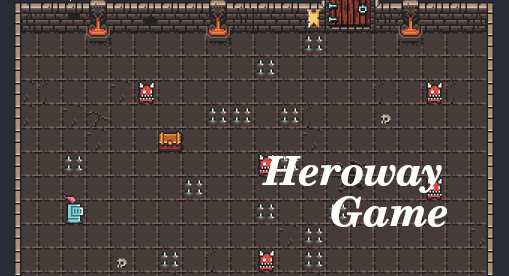

<h1 align="center">
    
</h1>

  

  

  
	
  
  

   

# About

Heroway Game is a game developed for Heroway's front-end event that took place in February, 2020. It covers basic JS, CSS and HTML concepts.
